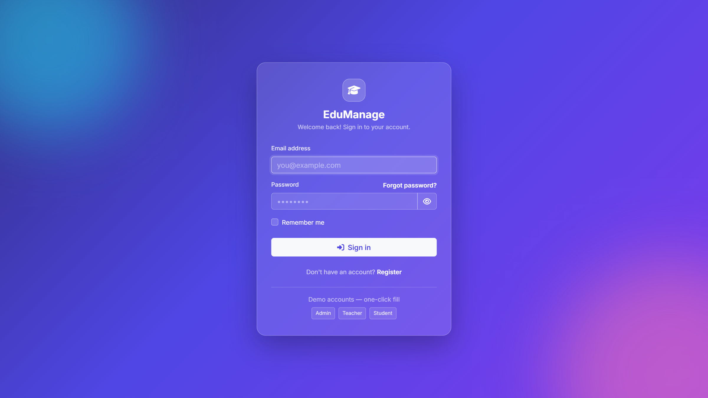
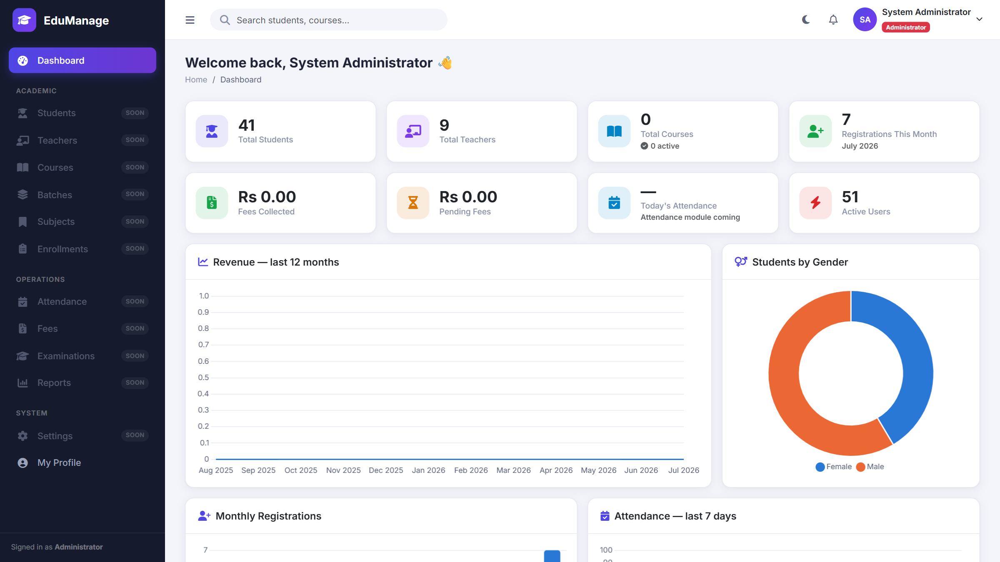
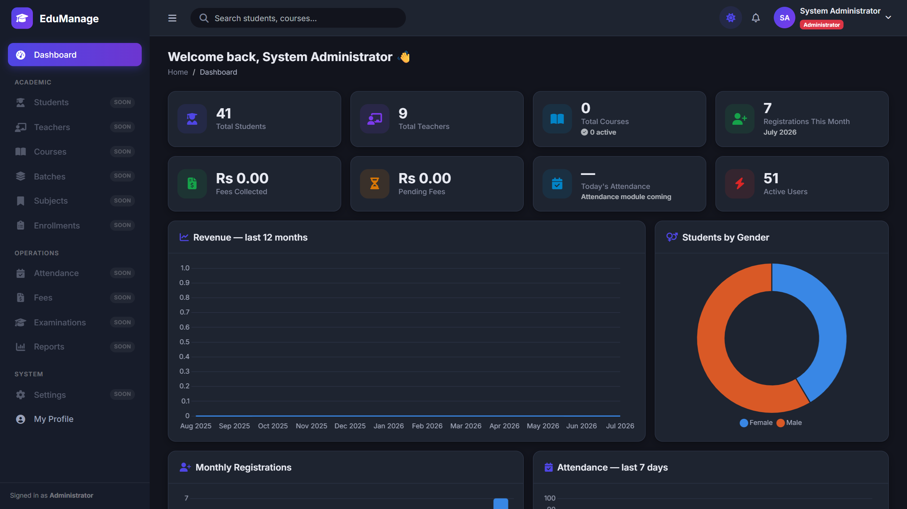
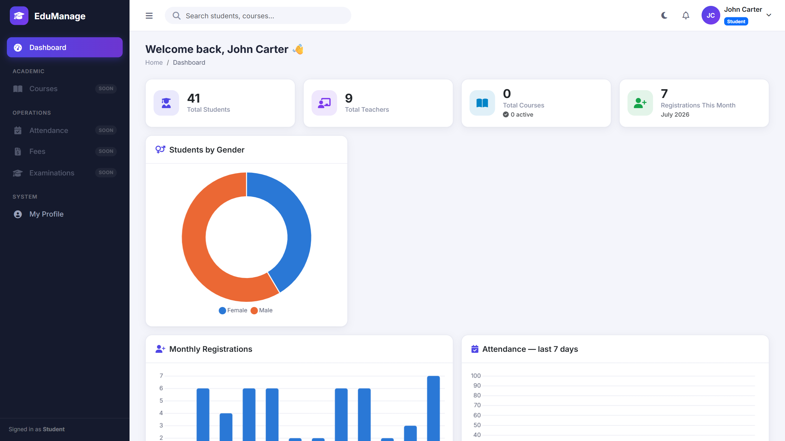
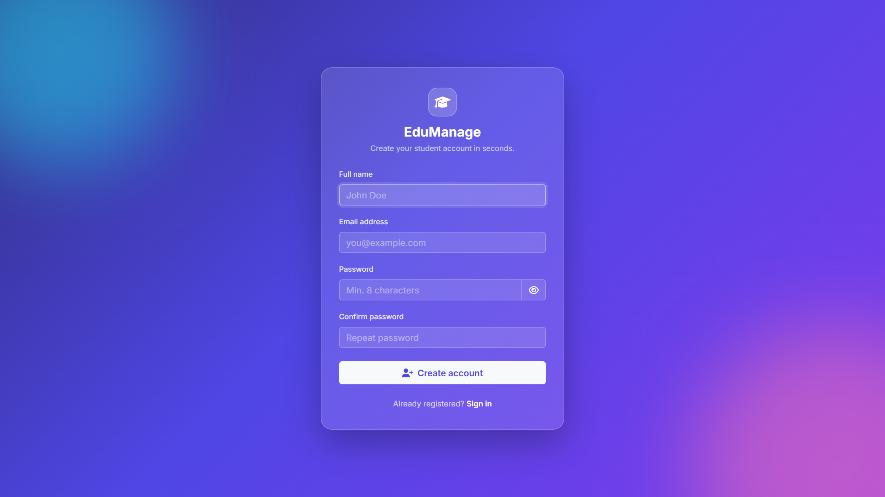
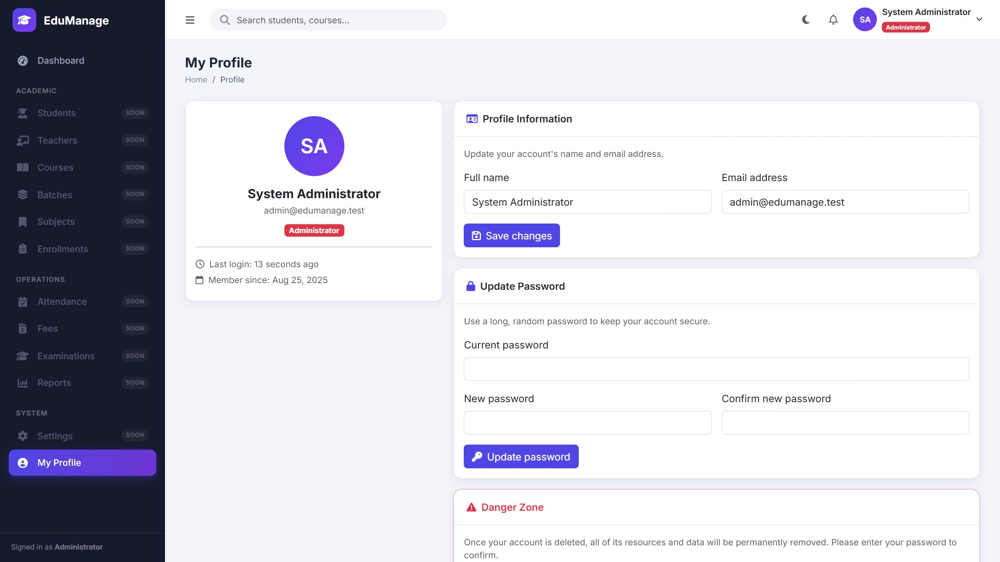

# EduManage — Student Management System

EduManage is a Laravel student management portfolio project with separate dashboards for administrators, teachers, and students.

The current foundation covers authentication, role-based access, profile management, and dashboards. Student records, attendance, fees, and examinations are planned modules.

**Stack:** Laravel 12 · PHP · MySQL · Blade · Bootstrap

[Setup](#getting-started) · [Screenshots](#screenshots) · [Testing](#testing) · [Architecture](#architecture-notes)

## Screenshots

### Login


### Admin Dashboard


### Dark Mode


### Role-Aware Dashboards
| Teacher | Student |
|---|---|
|  |  |

### Register & Profile
| Register | Profile |
|---|---|
|  |  |

## Tech Stack

| Layer | Technology |
|---|---|
| Backend | Laravel 12, PHP 8.4 |
| Database | MySQL 8 (SQLite in-memory for tests) |
| Frontend | Blade, Bootstrap 5.3, Chart.js, DataTables, SweetAlert2, FullCalendar, Font Awesome |
| Auth | Laravel Breeze (email verification, password reset, remember me) |
| Build | Vite |

## Features (Module 1 — Foundation, Auth & Dashboard)

- **Authentication** — glassmorphism login/register, email verification, password reset,
  remember me, one-click demo-account fill (local env only)
- **RBAC** — `admin` / `teacher` / `student` roles via enum cast, `role:` route middleware,
  gates with admin super-pass (`Gate::before`), deactivated-account lockout
- **Dashboard** — KPI stat cards, revenue chart, registrations chart, gender pie,
  attendance graph, recent-activity feed, calendar widget, role-aware quick actions
- **Admin shell** — collapsible sidebar (off-canvas on mobile), topbar with notifications
  and user menu, dark mode with persisted preference, page loader, skeleton chart loading
- **Activity log** — central `ActivityLogger` service records logins, registrations and
  (in later modules) every CRUD action
- Upcoming modules: Students, Teachers, Courses, Batches, Subjects, Enrollments,
  Attendance, Fees, Examinations, Reports, Notifications, Settings

## Getting Started

Use a local development database. The `migrate:fresh --seed` command below drops existing tables before loading demo data.

```bash
composer install
npm install

cp .env.example .env        # then set your DB credentials
php artisan key:generate

# create the MySQL database first:  CREATE DATABASE student_management;
php artisan migrate:fresh --seed
php artisan storage:link

npm run build               # or: npm run dev
php artisan serve
```

## Demo Accounts

| Role | Email | Password |
|---|---|---|
| Admin | `admin@edumanage.test` | `password` |
| Teacher | `teacher@edumanage.test` | `password` |
| Student | `student@edumanage.test` | `password` |

## Testing

```bash
php artisan test
```

The feature and unit test suites cover authentication, email verification, password flows,
profile management, role middleware, gates and the role-aware dashboard.

## Architecture Notes

- **Service layer** — `DashboardService` aggregates dashboard data (cached 60 s);
  `ActivityLogger` centralizes audit logging.
- **Enums** — `UserRole` / `UserStatus` are backed enums cast on the model, with UI
  helpers (labels, badge classes) kept beside the domain value.
- **Self-enabling navigation** — sidebar and quick actions light up automatically as each
  module registers its routes (`Route::has()`), so shipping a module requires no layout edits.
- **Security** — CSRF on all forms, hashed passwords, mass-assignment protection
  (registration ignores injected `role`), XSS-safe Blade escaping, policies per module.
